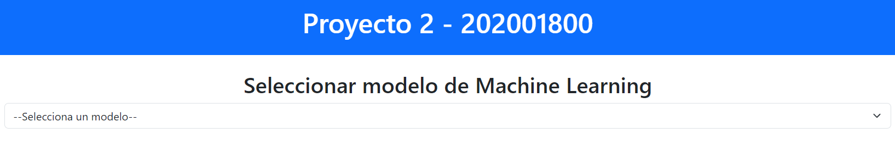
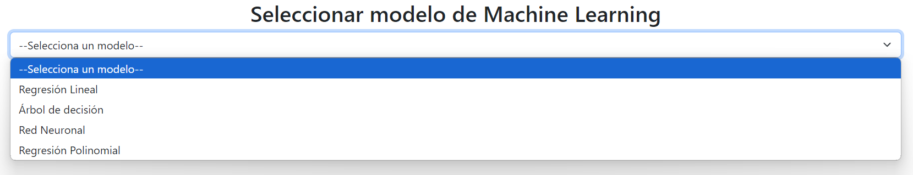
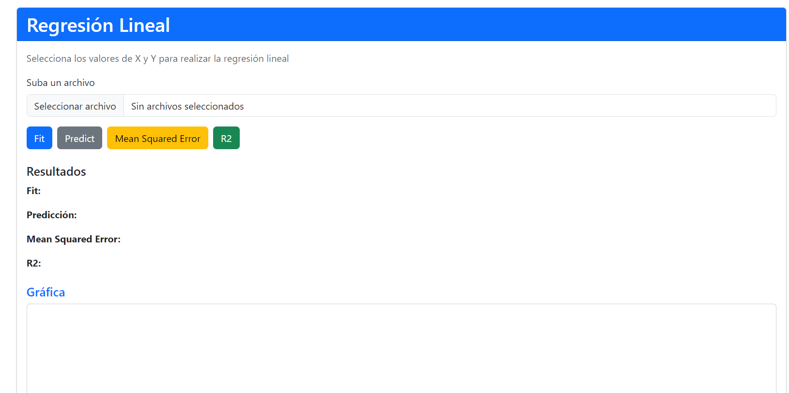
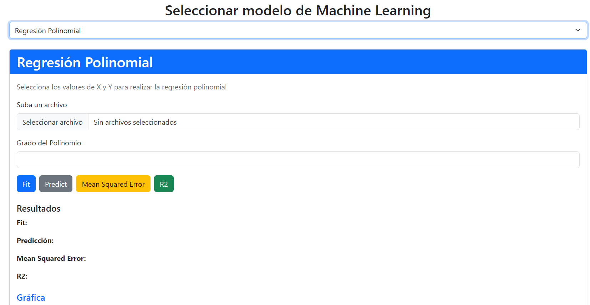
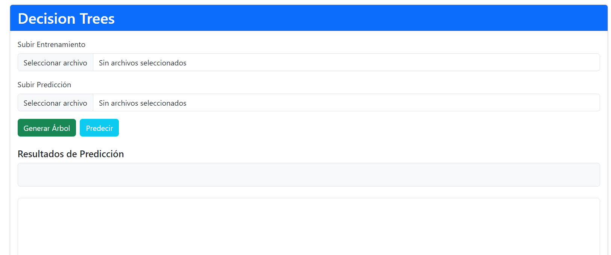
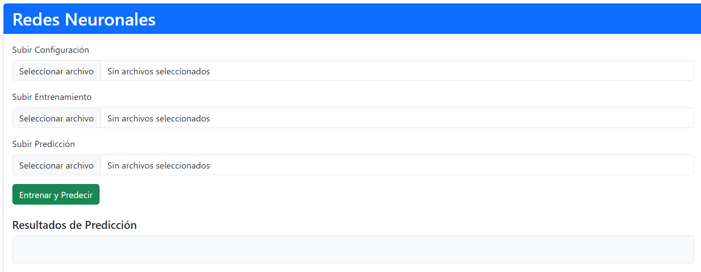

# Manual de Usuario

## Proyecto 2

### Laboratorio de Inteligencia Artificial

| Nombre                       | Carnet    |
| ---------------------------- | --------- |
| José Manuel Ibarra Pirir     | 202001800 |
___

## Inicio de la aplicación

Se observa la pagina principal donde se encuentras las opciones a elegir.

Opciones disponibles:

## Regresión Lineal

Se puede hacer carga de un .csv y se observa la grafica de la regresión lineal.

## Regresión Polinomial

Se puede hacer carga de un .csv, escoger el grado del polinomio y se observa la grafica de la regresión polinomial.

## Arbol de Decisión

Se puede hacer carga de un .csv para el entrenamiento y otro .csv para la predicción, se observa la grafica del arbol de decisión.

## Red Neuronal

Se puede hacer carga de un .csv para el la configuración, otro .csv para entrenamiento y otro .csv para la predicción, se observa los resultados obtenidos.
